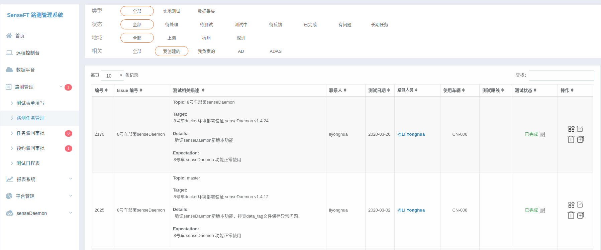
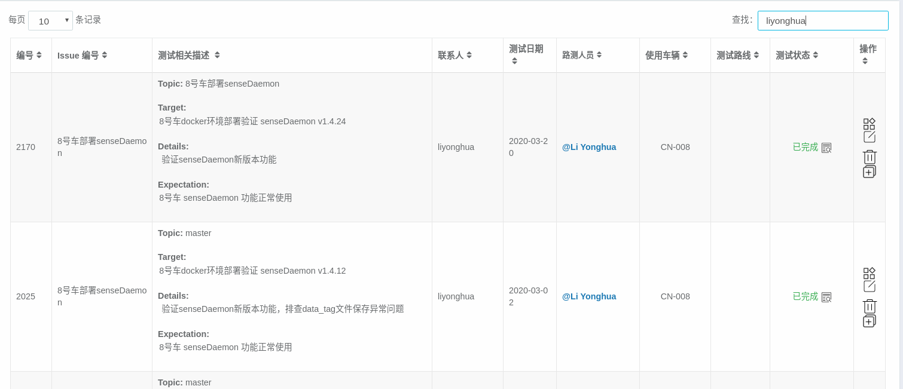
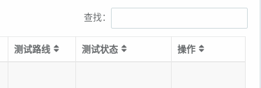
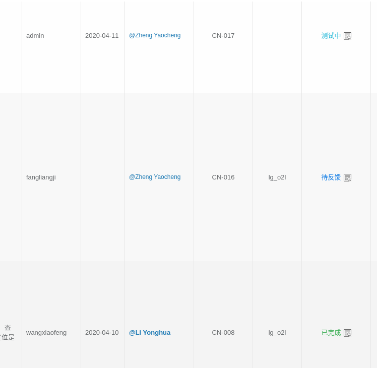
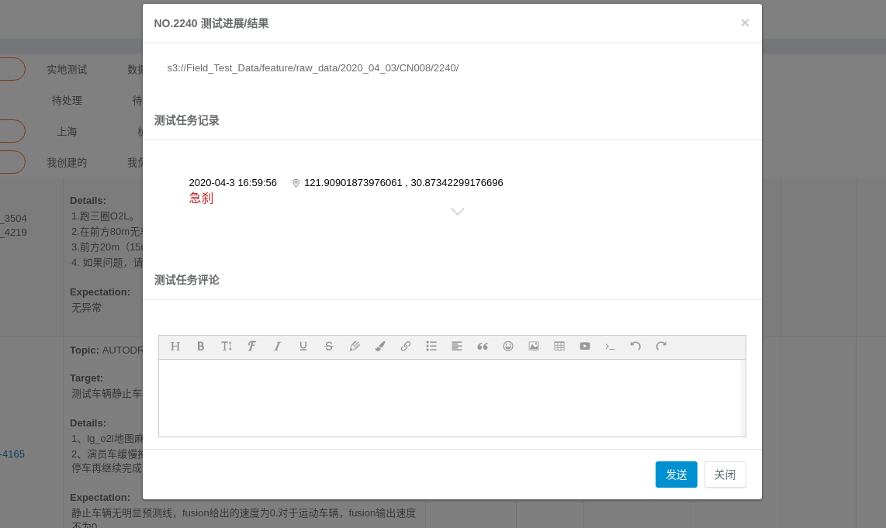
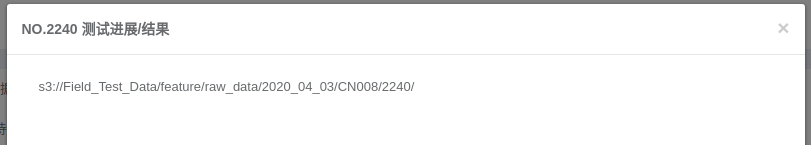
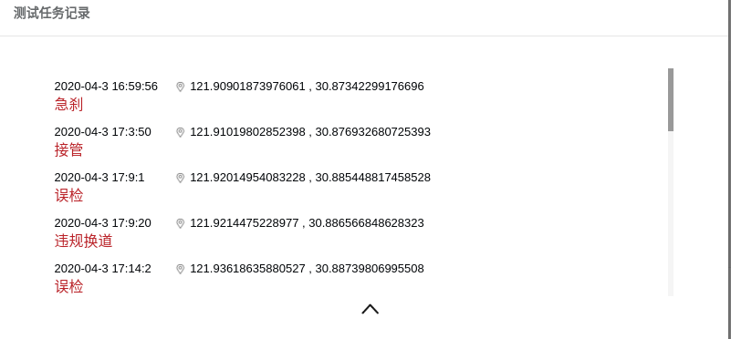
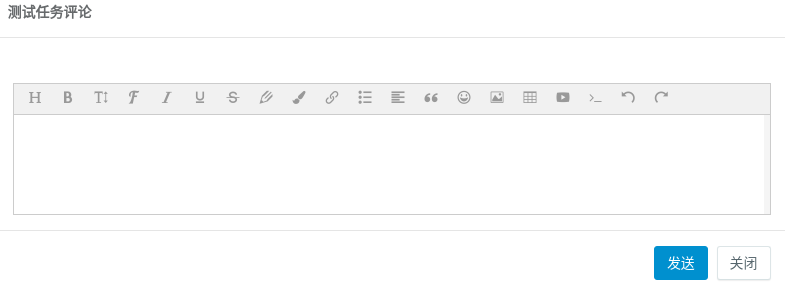

# \* 测试任务跟进和反馈

1. **找到自己关注的任务**

在系统 **路测管理** -&gt; **路测任务管理** 中，可以通过上方查询条件（如通过 **相关-&gt; 我创建的** 等）或者在任务列表右上角的查找输入关键信息（全文检索，可以搜索编号/issue编号/自己的姓名/测试内容），找到自己关注的任务．

**2. 查看任务的状态**

在任务列表中，每个任务都有其对应的任务 **测试状态 ,** 可以查看当前任务所处的状态

测试状态包含以下多个，**已完成** / **有问题** 表示测试或采集已经结束流程，其余代表流程中

  
**3. 查看任务的测试反馈和结果**

点击测试状态旁边的查看路测反馈（状态右侧的 icon 图标）

能看到路测任务目前的反馈情况，页面主要分为三个区域

1. 路测结果/问题反馈区域，该区域主要是由路测组工程师填写反馈的一些路测结论

　2. 测试过程问题点记录，记录了测试过程中的出现的问题点或特殊静态感知物体，包含出现的时间和地点

　3. 评论区，及时 comment

　

