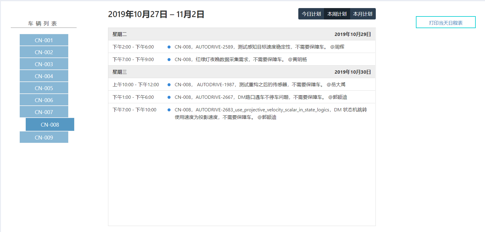

# 查询路测日程表

在系统 **路测管理** -&gt; **测试日程表** 中，查看测试任务预约和安排的日程表信息

测试日程表界面如下，分为左、中、右三个区域。

左边是车辆列表，同时也是选择查看车辆的按钮栏，中间区域是日程表内容，右边是打印当天日程表的按钮。

当点击左侧车辆列表项后，中间日程表将会显示所选车辆的预约安排情况，分别可以选择三种模式，分别是 **今日计划、本周计划、本月计划** 。

右边 **打印当天日程表** 按钮，如司机师傅调度需要查看当天测试日程表，点击会生成一个当天的全部车辆的测试预约安排日程表，精细度为每小时

该页面用于查看或者打印，打开该页面后，点击浏览器内置的打印功能，以Chrome 谷歌浏览器为例

​

点击浏览器其他功能选项，选择打印

然后生成预览信息，点击打印后即可。

